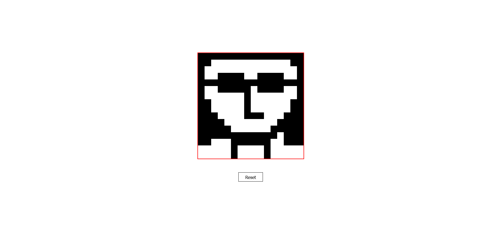

# Etch-a-sketch
A javascript project based on [Etch-a-sketch](https://en.wikipedia.org/wiki/Etch_A_Sketch) toy using simple DOM manipulation. This is a project in [odin project](https://www.theodinproject.com/lessons/foundations-etch-a-sketch) curriculum.

### How It Works
It used 16x16 grid layout, and wherever you hover over a pixel it gets colored(black). Reset button reset the grids, basically erasing all the changes.

link to the website:

