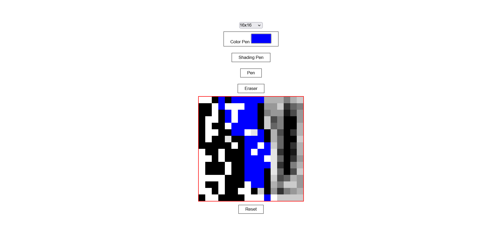

# Etch-a-sketch
A javascript project based on [Etch-a-sketch](https://en.wikipedia.org/wiki/Etch_A_Sketch) toy using simple DOM manipulation. This is a project in [odin project](https://www.theodinproject.com/lessons/foundations-etch-a-sketch) curriculum.

### How It Works

It is basically a sketch pad that contains grids, and on hover, it colors them.
Some of the functionality it contains are:
* Grid Layout : Lets you set various layouts such as 16x16, 32x32 and 100x100
* Color Pen: Lets you choose various color for pen.
* Pen : Normal pen it draws as a black color pen.
* Eraser : It erases whichever grid is filled, also works by hovering.
* Shading Pen: It is basically a pen but it is progressive darkening, meaning that for every empty cell/grid it succesesively add 10% of black color on hover.
* Reset : This resets your sketch pad, clearing all colored grid(s)/cell(s).

Live-preview : [website-link](https://akanksha493.github.io/etch-a-sketch/) 

