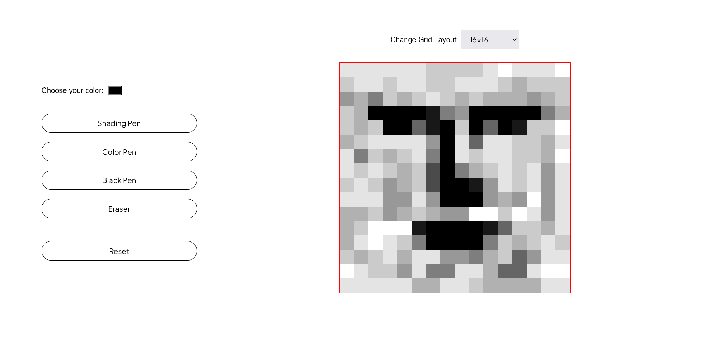

# Etch-a-sketch
A javascript project based on [Etch-a-sketch](https://en.wikipedia.org/wiki/Etch_A_Sketch) toy using simple DOM manipulation. This is a project in [odin project](https://www.theodinproject.com/lessons/foundations-etch-a-sketch) curriculum.

### How It Works

It is basically a sketch pad that contains grids, and on hover, it colors them.
Some of the functionality it contains are:

* Color selector: Lets you select color of your choice.
* Shading Pen: It is basically a pen but it is progressive darkening, meaning that for every empty cell/grid it succesesively add 10% of selected color on hover.
* Color Pen: Lets you choose various color for pen.
* Black Pen : Normal pen it draws as a black color pen. **Initially this is active by default**.
* Eraser : It erases whichever grid is filled, also works by hovering.
* Grid Layout : Lets you set various layouts such as 16x16, 32x32 and 100x100
* Reset : This resets your sketch pad, clearing all colored grid(s)/cell(s).

Live-preview : [website-link](https://akanksha493.github.io/etch-a-sketch/) 

Screenshot:

**NOTE : This website only works on desktop(not on a mobile device) as it uses hover event.**

### Useful Resources
Some of the resources I used while building this :

1. [for grid progressive darkening effect](https://codepen.io/Xaverrrrr/pen/rNQoOjV)
2. [for Space Between Inline Block Elements issue](https://css-tricks.com/fighting-the-space-between-inline-block-elements/)
3. [how to create grids](https://codepen.io/nakessler/pen/qOdJWm)
4. [how to control element sizing, maintain proper spacing, and implement fluid typography using CSS functions](https://web.dev/min-max-clamp/)
2. and Some other useful websites: [stackoverflow](https://stackoverflow.com/), [w3schools](https://www.w3schools.com/js/), [mdnwebdocs](https://developer.mozilla.org/en-US/docs/Learn/Getting_started_with_the_web/JavaScript_basics), [javascripttutorial.net](https://www.javascripttutorial.net/)
